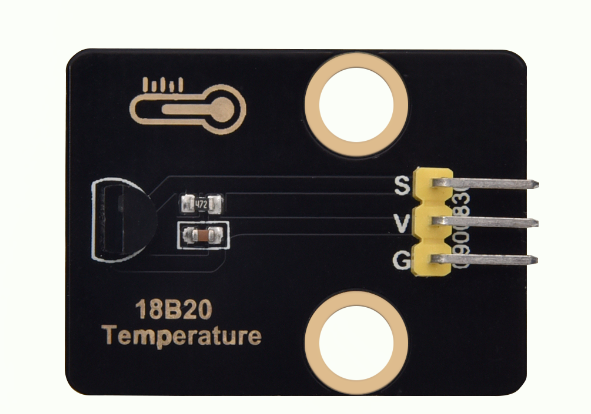
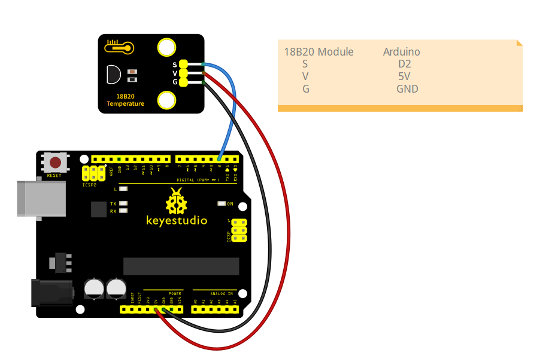

#  keyestudio 18B20 Module



## 1. Introduction

This tutorial explains how to use a DS18B20 Digital Temperature Sensor with an Arduino.
You will learn how to measure ambient temperature using the sensor and display the values in the Serial Monitor.
The DS18B20 is a popular, inexpensive, and waterproof-capable digital temperature sensor. It communicates over a “One-Wire” bus, which means you can connect multiple DS18B20 sensors to a single data pin on your microcontroller. The sensor provides temperature readings directly in digital form, so you don’t need an analog pin or additional ADC circuitry.

## 2.Specifications

| Parameter         | Description                                                  |
| ----------------- | ------------------------------------------------------------ |
| Operating Voltage | DC 5V                                                        |
| Control Method    | Arduino digital pins (D2–D13 are recommended; avoid D0 and D1 as they are used for serial communication) |
| Dimensions        | Length：31.5 mm     Width：23.5 mm                           |

## 3.Required Materials

- Arduino Uno （Compatible with ESP32, STM32, Raspberry Pi, and others）
-  keyestudio 18B20 Module
- Jumper wires

## 4.Wiring Instructions（Arduino UNO R3)

| 18B20 Module Pin | Arduino Pin                 |
| ---------------- | --------------------------- |
| VCC              | 5V                          |
| GND              | GND                         |
| S                | D2（or other digital pins） |



## 5.Sample Code

Read the ambient temperature using the DS18B20 digital temperature sensor and display the values in the Serial Monitor.

[libraries download](./libraries.7z)

```c
#include <OneWire.h>
#include <DallasTemperature.h>

// Data pin where DS18B20 is connected
// You can change 2 to any other digital pin
#define ONE_WIRE_BUS 2

// Setup a oneWire instance to communicate with any OneWire devices
OneWire oneWire(ONE_WIRE_BUS);

// Pass the oneWire reference to Dallas Temperature library
DallasTemperature sensors(&oneWire);

void setup() {
  // Initialize serial communication
  Serial.begin(9600);
  Serial.println("DS18B20 Temperature Reading Example");

  // Start the DS18B20 sensor
  sensors.begin();
}

void loop() {
  // Send the command to get temperatures
  sensors.requestTemperatures();

  // Read temperature in Celsius from the first sensor on the bus (index 0)
  float temperatureC = sensors.getTempCByIndex(0);

  // Check if reading is valid
  if (temperatureC == DEVICE_DISCONNECTED_C) {
    Serial.println("Error: DS18B20 sensor not detected or reading failed!");
  } else {
    Serial.print("Current temperature: ");
    Serial.print(temperatureC);
    Serial.println(" °C");
  }

  // Wait 1 second before next reading
  delay(1000);
}

```

**Experimental phenomena：**

- After uploading the code to your Arduino and opening the Serial Monitor (set to 9600 baud rate), the Arduino will start reading temperature data from the DS18B20 sensor.
- Approximately every 1 second (depending on the delay set in the code), the Serial Monitor will print the current temperature reading from the sensor.
